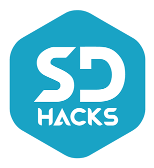

#  SD Hacks 2016 
 

### Usage

Assuming you already have the needed **MEAN Stack** pieces installed on your computer/server (**[MongoDB](https://www.mongodb.com/)** & **[NodeJS](https://nodejs.org/en/)**) as well as **Git** Just run:

    1. git clone
    2. cd SDHacks2016
    3. cp .env.example .env
    4. npm install
    5. bower install
    6. gulp
    
Edit any options in the new .env file to match your needs

From inside your app's folder and then open **http://localhost:3000** in your browser.
